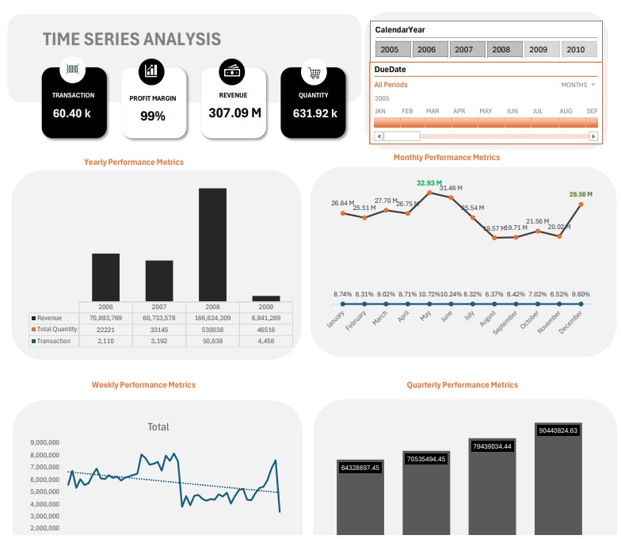

# Time_Series_Analysis
Conduct a comparative analysis of key performance indicators (KPIs) such as Cost of Goods Sold (COGS), Revenue, Quantity, Profit, Profit Margin, and Transactions relative to the previous year.
---
## **Business Requirement Document**
1.	Yearly Performance Metrics (Above Average Years):
Identify and evaluate years with total Revenue, Profit, and Transactions that exceed the average performance.
2.	Monthly Profit Trends:
Analyze profit trends every month to identify patterns and insights.
3.	Profit by Week Type:
Assess profit performance based on different week types to understand variations.
4.	Quarterly Profit Analysis:
Evaluate profit performance every quarter to track seasonal trends and performance fluctuations.
5.	Profit by Weekday:
Examine profit trends specific to weekdays to identify daily performance patterns. ⏲️

---

## VISUALIZATION 

[Click Here to Access complete Recommendation](https://github.com/IsaacUKEME/Time_Series_Analysis)
